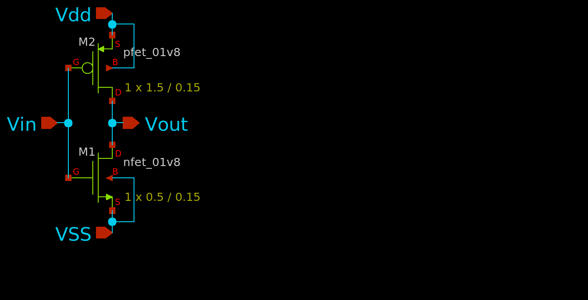

# Inverter-design-and-analysis-using-sky130pdk
Design and Analysis of CMOS Inverter using the sky130 pdk and various open source tools

This project has only one motive that is to experiment working of an inverter and understanding all the parameters involved in it's working. The design will utilise the models that are present under the sky water 130nm pdk and will also use various open source tools available such as, Xschem, NGSPICE, MAGIC, Netgen, etc. The whole process with contain design of schematic, measurement of various parameters like delays, noise margin, risetime, falltime, etc. Then we design a layout, after which we compare the two netlists and at that time this project would end.
 
Let's get right into it. 

