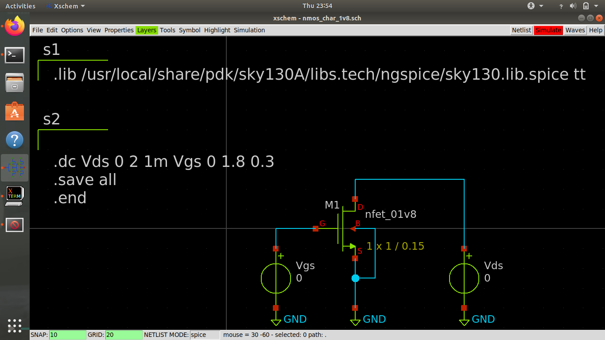

# Inverter-design-and-analysis-using-sky130pdk
### Design and Analysis of CMOS Inverter using the sky130 pdk and various open source tools
---
This project has only one motive; that is to experiment with working of an inverter and understanding all the parameters involved with it. The design will utilise the models that are present under the __skywater 130nm pdk__ and various open source tools such as, __Xschem__, __NGSPICE__, __MAGIC__, __Netgen__, etc.

The whole process starts with analysis of _NMOS_ and _PMOS_ devices, specifically the 1.8v standard models available inside the pdk to determine a common working W/L ratio and also the gm, ron and similar values. After this we start with the design of a CMOS inverter that includes schematic, measurement of various parameters like delays, noise margin, risetime, falltime, etc. This part would also act as a case study on __SPICE__ where we use it's programming capabilities to better our abilities in measurements of aforementioned parameters. Then we will engage in the design a layout for our inverter in __magic layout editor__. Here, we will also explore the different layers available to the user and how we utilise them in a design and what it translates to in terms of a mask. Lastly, we compare the two netlists, that is the schematic and the layout one, which is popularly referred to as ___LVS___. If everything is hunky-dory, this project would then conclude. 

I will try to keep updating it as often as possible, as this first project is a primary resource for me to practice analog design, with the open source toolchain and definitely to keep a documentation that is easily understandable by anyone who later tries to practice it the same way.

Let's get right into it. 


---

## Contents
- [1. Tool and PDK Setup](#1-Tools-and-PDK-setup)
  - [1.1 Tools Setup](#1.1-Tools-setup)
  - [1.2 PDK Setup](#1.2-PDK-setup)
- [2. Analysis of MOSFET models](#2-Analysis-of-MOSFET-models)
  - [2.1 General MOS analysis](#2.1-General-MOS-analysis)

###### Section 1 has been copies from [VSDOPEN21_BGR Readme file](https://github.com/D-curs-D/vsdopen2021_bgr/edit/main/README.md) Thanks [Kunal](https://github.com/kunalg123)!

## 1. Tools and PDK setup

### 1.1 Tools setup
For the design and simulation of the BGR circuit we will need the following tools.
- Spice netlist simulation - [Ngspice]
- Layout Design and DRC - [Magic]
- LVS - [Netgen]

#### 1.1.1 Ngspice 


[Ngspice](http://ngspice.sourceforge.net/devel.html) is the open source spice simulator for electric and electronic circuits. Ngspice is an open project, there is no closed group of developers.

[Ngspice Reference Manual](http://ngspice.sourceforge.net/docs/ngspice-manual.pdf): Complete reference manual in HTML format.

**Steps to install Ngspice** - 
Open the terminal and type the following to install Ngspice
```
$  sudo apt-get install ngspice
```
#### 1.1.2 Magic


 [Magic](http://opencircuitdesign.com/magic/) is a VLSI layout tool.
 
**Steps to install Magic** - 
 Open the terminal and type the following to install Magic
```
$  wget http://opencircuitdesign.com/magic/archive/magic-8.3.32.tgz
$  tar xvfz magic-8.3.32.tgz
$  cd magic-8.3.28
$  ./configure
$  sudo make
$  sudo make install
```
#### 1.1.3 Netgen


[Netgen](http://opencircuitdesign.com/netgen/) is a tool for comparing netlists, a process known as LVS, which stands for "Layout vs. Schematic". This is an important step in the integrated circuit design flow, ensuring that the geometry that has been laid out matches the expected circuit.

**Steps to install Netgen** - Open the terminal and type the following to insatll Netgen.
```
$  git clone git://opencircuitdesign.com/netgen
$  cd netgen
$  ./configure
$  sudo make
$  sudo make install 
```
#### 1.1.4 Xschem

[Xschem](http://repo.hu/projects/xschem/xschem_man/xschem_man.html) is a schematic capture program that allows to interactively enter an electronic circuit using a graphical and easy to use interface. When the schematic has been created a circuit netlist can be generated for simulation.

**Steps to install Xschem**
Follow the instructions given [here](http://repo.hu/projects/xschem/xschem_man/tutorial_install_xschem.html) or follow [this](https://www.youtube.com/watch?v=jXmmxO8WG8s) video tutorial by the creator himself

### 1.2 PDK setup

A process design kit (PDK) is a set of files used within the semiconductor industry to model a fabrication process for the design tools used to design an integrated circuit. The PDK is created by the foundry defining a certain technology variation for their processes. It is then passed to their customers to use in the design process.

The PDK we are going to use for this BGR is Google Skywater-130 (130 nm) PDK.


**Steps to download PDK** - Open the terminal and type the following to download sky130 PDK.
```
$  git clone https://github.com/RTimothyEdwards/open_pdks.git
$  cd open_pdks
$  ./configure [options]
$  make
$  [sudo] make install
```

*or you can also use the instructions given at [open_pdk installation](http://opencircuitdesign.com/open_pdks/index.html), and also for all the other applications used here can be found at [Open Circuit Design](opencircuitdesign.com/) website. The website covers details about a lot of opensource tools, with details about their usage installation etc.*

## 2. Analysis of MOSFET models

#### General NMOS Analysis

In this section I start with our analysis of MOSFET models present in sky130 pdk. I would be using the 1.8v transistor models, but you can definitely use and experiment with other ones present there. below is the schematic I created in **Xschem**.

___highly recommended to check out the tutorials of xschem [here](http://repo.hu/projects/xschem/xschem_man/xschem_man.html)___



The components used are:<br>
```nfet_01v8.sym``` - from xschem_sky130 library<br>
```vsource.sym``` - from xschem devices library<br>
```code_shown.sym``` - from xschem devices library<br>


